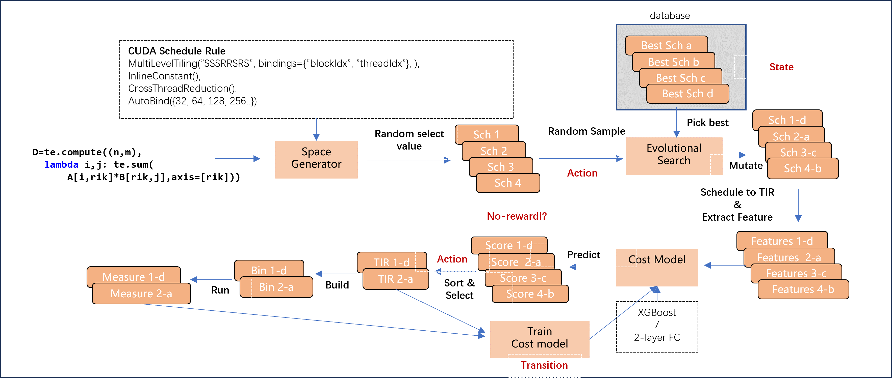
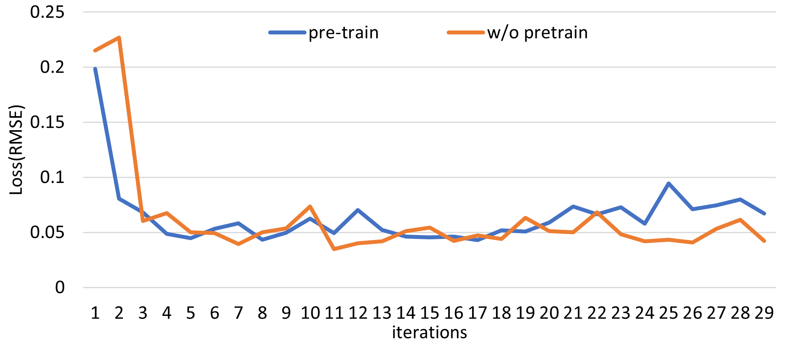
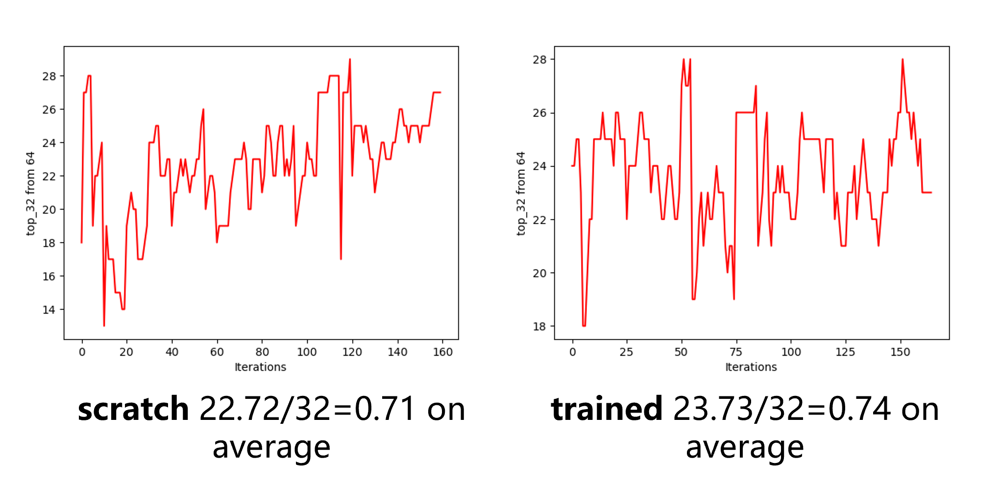
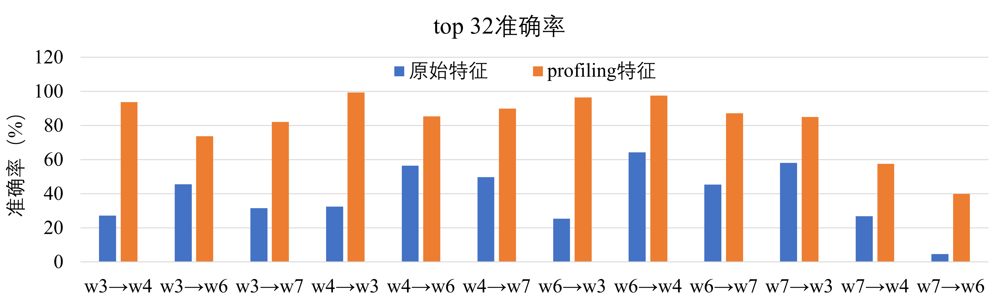

## Cost Model for Tensor Programs

### [中文版](README_CN.md)

### How to build from source
Firstly, clone this repo.
```shell
git clone https://github.com/summerspringwei/tvm_oraa.git
git checkout RL-scheduler
```
Then, Please refer to [Install from Source](https://tvm.apache.org/docs/install/from_source.html) to build this project.

### Introduction

We implemented a improved cost model based on TVM.
The following figure shows the auto-tuining  workflow of TVM.



### Motivation
We found that the prediction accuracy is low for the current cost model.
Firstly, we tested the Rooted Mean Square Error (RMSE) for the XGBoost model.

The horizontal axis shows the training iterations,
the vertical shows the RMSE.
The blue line is predicted on a pre-trained model while the yellow line is trained from scratch.
We can see that the difference between a pre-trained and a scratch model is minor.

We also tested the prediction accuracy of MLP model.
The vertical axis shows the `top-32` accuracy for `64` test samples.
The left figure shows the accuracy on a MLP scratch model while the right figure shows the accuracy on a pre-trained model.
The accuracy difference is also minor ($0.71$ vs $0.74$).



### Features

We select the following features:
* Device attributes
    * \# of SM
    * Memory bandwidth
    * L2 cache size
* Memory access
    * \# of load/store
    * latency
    * bandwidth
* On-chip buffer access
    * \# shared memory load/store
    * cache miss ratio
* Launch dimention
    * \# launch blocks and thread

refer to `mcu_metrics_utils.py:preprocessing_func_mapping` for detailed explaination.


### Overall Workflow

1. Prepare Dataset
    * we collect features from tuning records (A tuning record is a series of schedules).
    The tuning records will be lowered down to `tir` and then be compiled to kernels.
2. Get Tuning Records
    * Secondly, We then run the kernels on hardware and collect features from the profile.
3. Run Tuning Records and Collect Profiling Data
    * we train the cost model on the profiling data and validate the accuracy.
4. Compare the Accuracy of Cost Model


### 1. Prepare Dataset

Download tenset dataset:
```shell
pip3 install gdown
gdown https://drive.google.com/uc?id=1jqHbmvXUrLPDCIqJIaPee_atsPc0ZFFK
unzip dataset_gpu_v3.3.zip
```
Please refer to [get_started_with_cost_model_experiments](https://github.com/tlc-pack/tenset/blob/main/docs/get_started_with_cost_model_experiments.md) for the detailed instructions.

### 2. Get Tuning Records

Run the following commands:

```shell
python3 tenset_load_datasets_and_tune.py \
    --task "path/to/dataset_gpu/network_info/((bert_base,[(1,128)]),cuda).task.pkl"
```
If you want to change the number of tuning trials or cost model,
run `python3  tenset_load_datasets_and_tune.py --help` to see the detailed arguments.

### 3. Run Tuning Records and Collect Profiling Data
Run
```shell
ncu --target-processes all \
    --clock-control none --set full \
    --csv -o bert_base_1_128_workload_0-ncu \
    python3 load_database_and_train_cost_model.py
```
This will run the cuda kernels and collect the features.

### 4. Compare the Accuracy of Cost Model
Run

```shell
python3 train_ncu_profile.py
```

Finaly, we can get the output:

