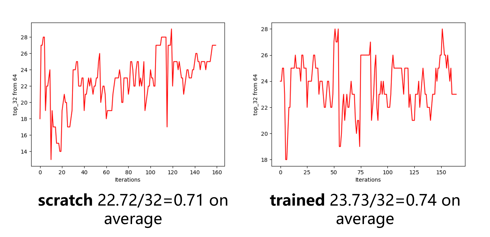

## 张量程序的成本模型


### 如何从源代码构建

请参阅[从源代码安装](https://tvm.apache.org/docs/install/from_source.html)。

### 简介

我们基于TVM实现了一个改进的成本模型。
以下图显示了TVM自动调整的工作流程。


### 动机
我们发现当前成本模型的预测准确性较低。
首先，我们测试了XGBoost模型的根均方误差（RMSE）。

横轴表示训练迭代次数，纵轴表示RMSE。
蓝线表示在预训练模型上的预测，而黄线表示从头开始训练的模型。
我们可以看到预训练模型和从头训练模型之间的差异很小。

我们还测试了MLP模型的预测准确性。
纵轴显示了对64个测试样本的`top-32`准确性。
左图显示了MLP从头开始模型的准确性，而右图显示了预训练模型的准确性。
准确性差异也很小（$0.71$ vs $0.74$）。



### 特征

我们选择以下特征：
* 设备属性
    * SM的数量
    * 内存带宽
    * L2缓存大小
* 内存访问
    * 加载/存储的数量
    * 延迟
    * 带宽
* On-chip缓冲区访问
    * 共享内存加载/存储的数量
    * 缓存未命中比例
* 启动维度
    * 启动块和线程的数量

详细说明请参考`mcu_metrics_utils.py:preprocessing_func_mapping`。


### 整体工作流程

首先，我们从调整记录（调整记录是一系列调度）中收集特征。
调整记录将被降级到`tir`，然后编译为内核。
其次，我们在硬件上运行内核，并从配置文件中收集特征。
最后，我们根据配置文件上的训练数据训练成本模型并验证准确性。

### 准备数据集

下载张量数据集：
```shell
pip3 install gdown
gdown https://drive.google.com/uc?id=1jqHbmvXUrLPDCIqJIaPee_atsPc0ZFFK
unzip dataset_gpu_v3.3.zip
